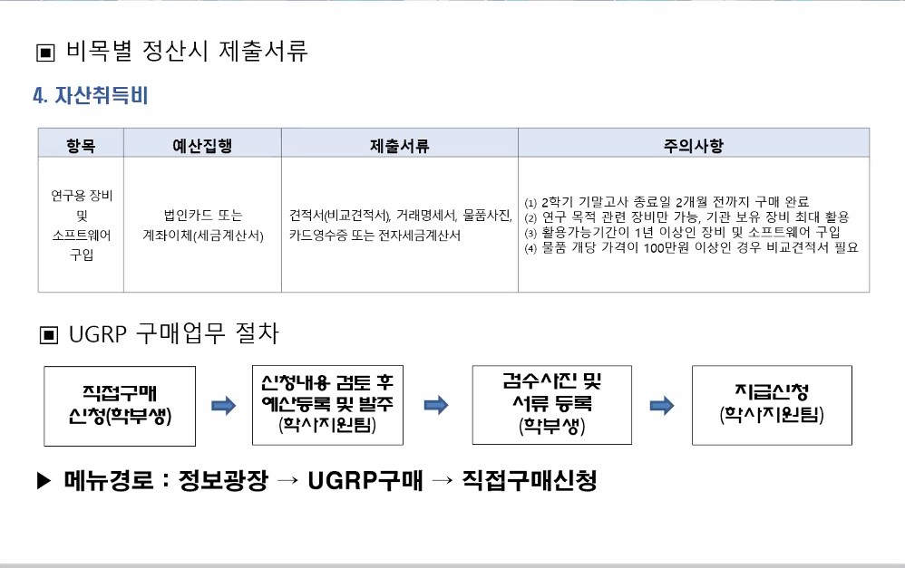
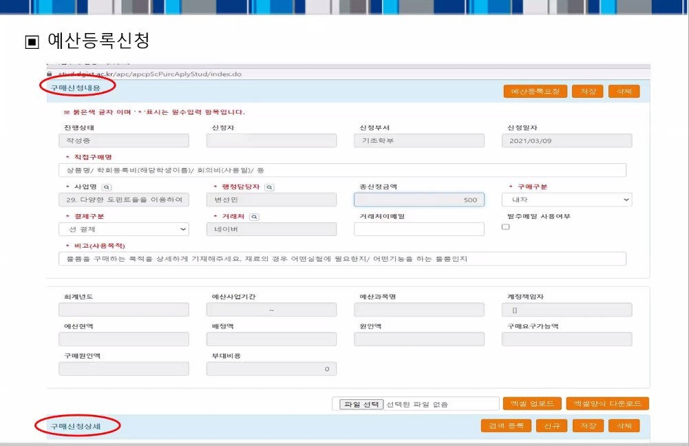

# Buying Devices

  - [Jetson Nano](https://www.devicemart.co.kr/goods/view?no=12513656&gclid=Cj0KCQjwktKFBhCkARIsAJeDT0gi-amJMSPyNi03J2ePYi86bRYRq4Y_Rd3L3mcs527j9gIkUmpnvIcaAs_iEALw_wcB)
  - [Wireless Lan Card](https://www.devicemart.co.kr/goods/view?no=12532502)
  - [Antena and Cables](https://www.devicemart.co.kr/goods/view?no=12508567)
  - [Power Adapter](https://www.devicemart.co.kr/goods/view?no=12504448)

# About Fund

# Extra Explanation

법인카드는 쓰고 바로 반납해야하고, 인터넷 결제도 항상 방문해서 해야합니다.  

예산 신청 때 내자/외자는 해당 물품을 결제하는 통화에 따라 정해집니다.  

신청시에 견적서를 첨부해야하는데 온라인 결제시 장바구니 사진 등으로 대체 가능합니다.  

물건 받은 후 10일 이내에 온라인으로 검수등록하면 되는데 이때 물품사진을 GPS를 키고 찍어서 사진에 장소기록이 남게 해야합니다.  

검수서류로 내는 전표에는 카드번호 뒷 네자리가 명시되어 있어야 하며 혹은 인터넷 결제시 배송완료가 적힌 사진으로 대체 가능합니다. 
